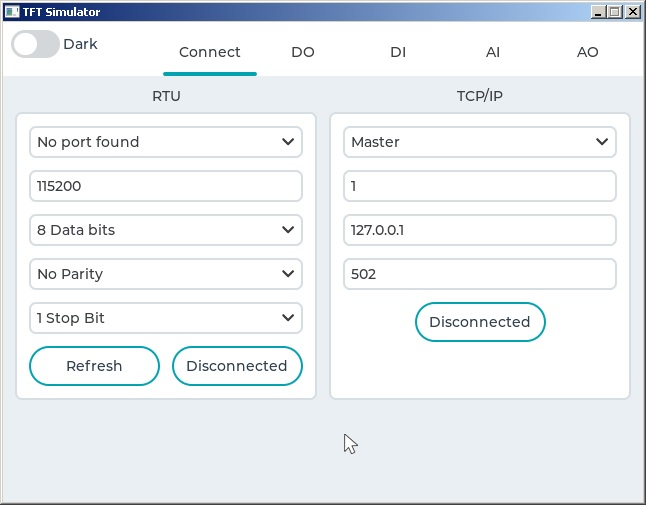
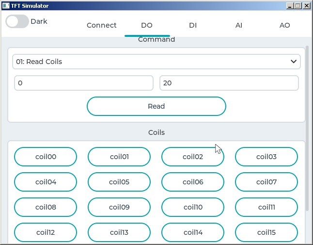
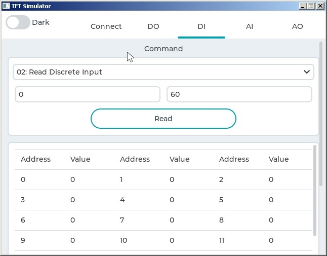
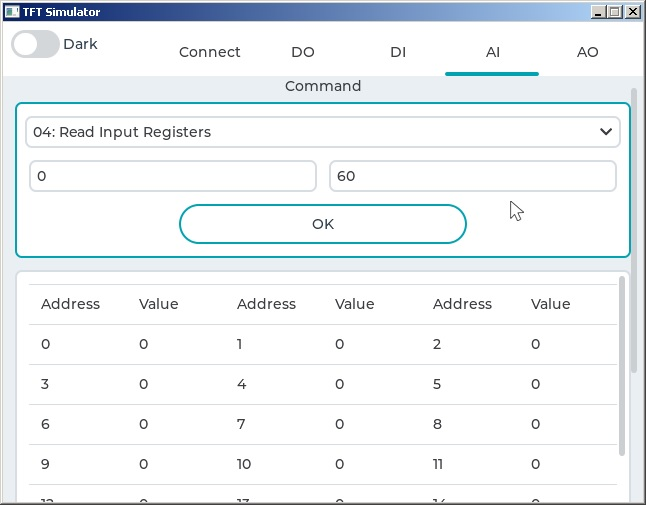
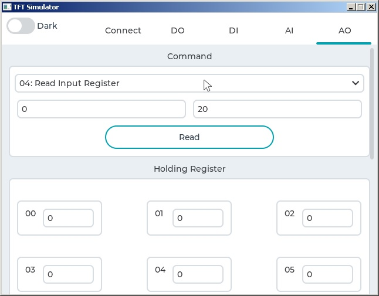

# EmbeddedMasterModbusGUI
This GUI uses LVGL and libmodbus libraries to read and write  DO(coils),DI(discrete register),AI(Input Register) and AO (Holding Register)

#Getting Started
To compile the program you can simply open the console to project folder and execute command. I use MSYS2 MinGW.Compiled binary is also available in the bin folder

```
mkdir build
cd build
cmake -G "MSYS Makefiles" ..
...
cmake --build .
```

to compile the project you need to add SDL2 library to your compiler.







###ToDoes
- [x] Modbus-TCP Master 
- [ ] Modbus-RTU Master
- [X] Add CMake support
- [X] Add support for windows
- [ ] Add support for linux


